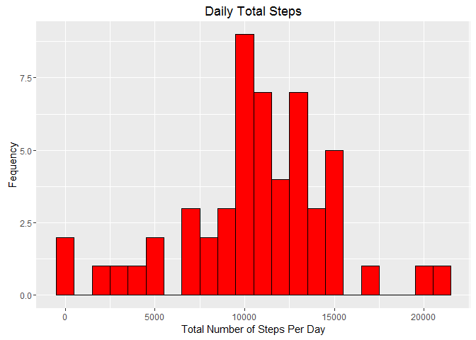
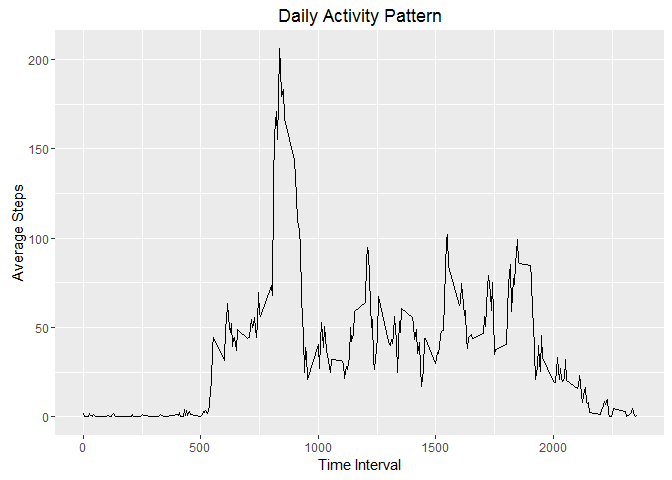
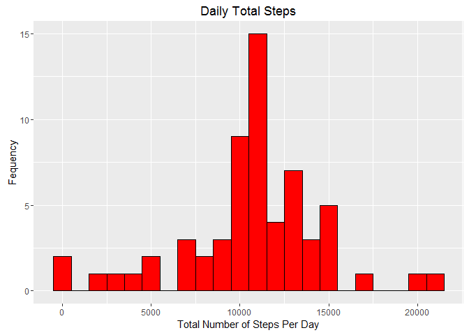
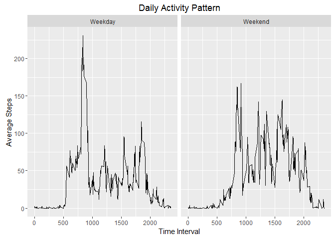

# PA1_Template
Alex Taikh  
October 23, 2016  


## Loading and preprocessing the data


```r
#Set Working Directory & Download File
setwd("C:/Users/Owner/Desktop/ReproducibleResearch")
activity <- read.csv("C:/Users/Owner/Desktop/ReproducibleResearch/activity.csv")
#View variables
str(activity[1:10,])
```

```
## 'data.frame':	10 obs. of  3 variables:
##  $ steps   : int  NA NA NA NA NA NA NA NA NA NA
##  $ date    : Factor w/ 61 levels "2012-10-01","2012-10-02",..: 1 1 1 1 1 1 1 1 1 1
##  $ interval: int  0 5 10 15 20 25 30 35 40 45
```

```r
#Convert date variable 
activity$date <- as.Date(activity$date, "%Y-%m-%d")
```

## What is the mean number of steps taken per day?


```r
library(ggplot2)


#Calculate total number of steps per day, remove missing values
sum_steps <- aggregate(steps ~ date, data = activity, FUN = sum, na.rm = TRUE)

#Histogram of total number of steps
ggplot(sum_steps, aes(x = steps)) + 
    geom_histogram(binwidth = 1000, color = "black", fill = "red") +
    labs(x = "Total Number of Steps Per Day", y = "Fequency", title = "Daily Total Steps")
```

<!-- -->

```r
#Mean and median of the total number of steps
Mean_total_steps <- mean(sum_steps$steps)
Mean_total_steps
```

```
## [1] 10766.19
```

```r
Median_total_steps <- median(sum_steps$steps)
Median_total_steps
```

```
## [1] 10765
```

## What is the average daily activity pattern


```r
#Removing missing values and aggregating
activity_pattern <- aggregate(steps ~ interval, data = activity, FUN = mean, na.rm = TRUE)

#Timeseries plot of mean number of steps
ggplot(activity_pattern, aes(x = interval, y = steps)) +
    geom_line() +
    labs (x = "Time Interval", y  = "Average Steps", title = "Daily Activity Pattern")
```

<!-- -->

```r
#The 5-min interval with the most steps is
max_interval <- activity_pattern[which.max(activity_pattern$steps),]
max_interval
```

```
##     interval    steps
## 104      835 206.1698
```

## #Imputing missing values


```r
library(plyr)

#Total number of missing values in dataset
missing_values <- sum(is.na(activity$steps))
missing_values
```

```
## [1] 2304
```

```r
activity2<- activity

#Calculate the mean steps for each interval
impute.mean <- function(x) replace(x, is.na(x), mean(x, na.rm = TRUE))
activity_imputed<-as.data.frame(ddply(activity, ~ interval, transform, steps = impute.mean(steps)))

#Calculate total number of steps per day, remove missing values
sum_stepsI <- aggregate(steps ~ date, data = activity_imputed, FUN = sum, na.rm = TRUE)

#Histogram of total number of steps
ggplot(sum_stepsI, aes(x = steps)) + 
    geom_histogram(binwidth = 1000, color = "black", fill = "red") +
    labs(x = "Total Number of Steps Per Day", y = "Fequency", title = "Daily Total Steps")
```

<!-- -->

```r
#Mean and median of the total number of steps
MeanI_total_steps <- mean(sum_stepsI$steps)
MeanI_total_steps
```

```
## [1] 10766.19
```

```r
MedianI_total_steps <- median(sum_stepsI$steps)
MedianI_total_steps
```

```
## [1] 10766.19
```
Imputation was done by substituting the mean of the 5 minute interval (averaged over all days) for all missing values in that particular interval. The imputed data look very similar to the data where all missing values were removed as seen in the histogram. While the mean is the same, the median has now become the mean.

## Are there differences in activity patterns between weekdays and weekends?


```r
#Columns with weekdays
activity_imputed$day <- weekdays(activity_imputed$date)
activity_imputed$dayfactor <- ifelse(activity_imputed$day == "Saturday"|
                                 activity_imputed$day == "Sunday", "Weekend", "Weekday")

#Timeseries plot of mean number of steps
activity_comparison <- aggregate(steps ~ dayfactor + interval, data = activity_imputed, FUN = mean, na.rm = TRUE)

ggplot(activity_comparison, aes(x = interval, y = steps)) +
    geom_line() +
    facet_grid(. ~ dayfactor) +
    labs (x = "Time Interval", y  = "Average Steps", title = "Daily Activity Pattern")
```

<!-- -->
